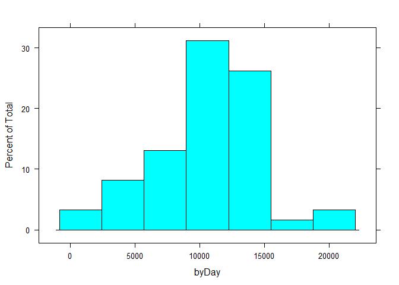
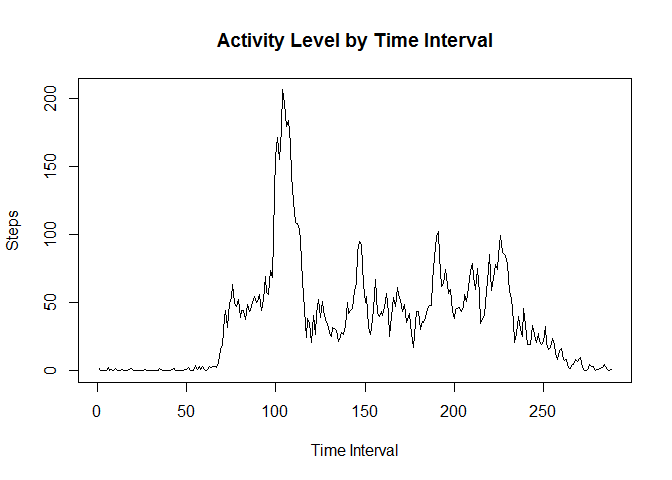
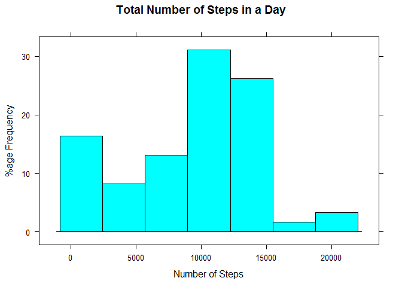
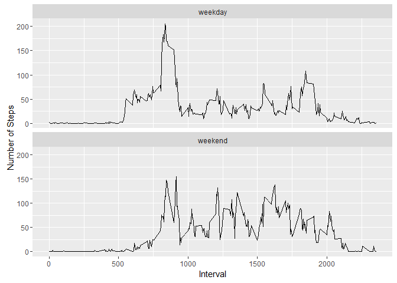

# Reproducible Research: Peer Assessment 1


## Loading and preprocessing the data

```r
library(knitr)
library(dplyr)
library(lattice)
library(ggplot2)

data <- read.csv(file ="activity.csv", na.strings = "NA")
data1 <- data[complete.cases(data),]
```


## What is mean total number of steps taken per day?

Sort the data by day and calculate the sum using tapply. Plot a histogram to illustrate the data.

```r
byDay = tapply(data1$steps, data1$date, FUN=sum)
histogram(byDay)
```

<!-- -->

```r
summary(byDay)
```

```
##    Min. 1st Qu.  Median    Mean 3rd Qu.    Max.    NA's 
##      41    8841   10760   10770   13290   21190       8
```
The Median is 1.076\times 10^{4} and the Mean is 1.077\times 10^{4} steps per day.


## What is the average daily activity pattern?

Group by time interval and plot.

```r
byTimeInterval = tapply(data1$steps, data1$interval, FUN=mean)

plot(byTimeInterval, type="l", main="Activity Level by Time Interval", ylab="Steps", xlab="Time Interval")
```

<!-- -->


```r
max <- names(byTimeInterval[byTimeInterval==max(byTimeInterval)])
```
The most active interval is 835


## Imputing missing values

We calculate the number of complete cases and subtract from the total to give us the total number of incomplete cases:

```r
sum(is.na(data))
```

```
## [1] 2304
```

This is the number of missing values.

To fill in the missing values, we take the median value for that particular time interval from the dataset after removing the missing values. Then we add these values to the original dataset.

```r
medianByTimeInterval = tapply(data1$steps, data1$interval, FUN=median)
dataImputed = data
for(i in 1:nrow(dataImputed)){
	if(is.na(dataImputed$steps[i])){
		dataImputed$steps[i] = medianByTimeInterval[dataImputed$interval[i]== names(medianByTimeInterval)]
	}
}
```
Now we compare this tidied dataset to our previous dataset with missing values ignored


```r
byDayImputed = tapply(dataImputed$steps, dataImputed$date, FUN=sum)
histogram(byDayImputed, main="Total Number of Steps in a Day", xlab="Number of Steps", ylab="%age Frequency")
```

<!-- -->

```r
summary(byDayImputed)
```

```
##    Min. 1st Qu.  Median    Mean 3rd Qu.    Max. 
##      41    6778   10400    9504   12810   21190
```
The Median is 1.04\times 10^{4} (10400) and the Mean is 9504 (9504) steps per day.
The previous Median is 1.076\times 10^{4} (10760) and the Mean is 1.077\times 10^{4} (10770) steps per day.

Our method of imputing has reduced the mean and the median of the dataset since we imputed using the median of the dataset, which necessarily ignores the higher values that skew the mean upwards. 

## Are there differences in activity patterns between weekdays and weekends?

We create the additional factor in the dataset

```r
dataImputed$day = ifelse(weekdays(as.Date(dataImputed$date))=='Saturday' | weekdays(as.Date(dataImputed$date))=='Sunday', 'weekend', 'weekday')
dataImputed$day = as.factor(dataImputed$day)
```

Now we make two plots to compare activity during weekdays and weekends

```r
meanByIntervalImputed = aggregate(steps ~ interval + day, dataImputed, mean)

qplot(interval, steps, data=meanByIntervalImputed, geom=c("line"), ylab="Number of Steps", xlab="Interval") + facet_wrap(~ day, ncol=1)
```

<!-- -->
